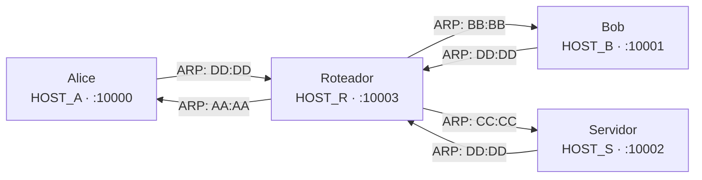

# A Mini Net


Projeto integrador da disciplina de **Redes de Computadores – INF-UFG 2025/4**.

**Autores:** Andre Koraleski &amp; Henrick Souza

O produto final é uma aplicação de **chat** que funciona sobre um canal
propositalmente defeituoso (perda de pacotes, corrupção de bits, latência
variável), implementando do zero todas as garantias que normalmente delegaríamos
ao TCP.

O Manual do Projeto indica quatro fases, começando pela aplicação e terminando na camada de enlace. 

No entanto, como a estrutura é a de uma pilha, nós preferimos ir pelo exato contrário, começando pela base que todos acima dependem e então encapsulando. Isso pode ser visto no histórico de *commits* do projeto.

Esta é a terceira e derradeira versão do repositório, com uma estrutura mais intuitiva, maneira mais simples de se executar e uma narrativa embutida em seus metadados enquanto (tentando) esconder grande parte do processo sujo de desenvolvimento rápido realizado por nós dois em um repositório privado.

Apagar em uma semana, lembrar:
[Vídeo de Demonstração](https://youtu.be/eSTI6D1iMlU)
```
┌─────────────┐
│  Aplicação  │  <- Quinto Implementado
├─────────────┤
│  Transporte │  <- Quarto Implementado
├─────────────┤
│    Rede     │  <- Terceiro Implementado
├─────────────┤
│   Enlace    │  <- Segundo Implementado
├─────────────┤
│   Física    │  <- Primeiro Implementado
├─────────────┤
│  UDP real   │
└─────────────┘
```

## Topologia



Todos os nós rodam em `127.0.0.1`, diferenciados pela porta. Hosts enxergam o
Roteador como único vizinho via ARP. O Roteador conhece todos diretamente.

| Host     | VIP    | MAC               | Porta |
| -------- | ------ | ----------------- | ----- |
| Alice    | HOST_A | AA:AA:AA:AA:AA:AA | 10000 |
| Bob      | HOST_B | BB:BB:BB:BB:BB:BB | 10001 |
| Servidor | HOST_S | CC:CC:CC:CC:CC:CC | 10002 |
| Roteador | HOST_R | DD:DD:DD:DD:DD:DD | 10003 |

## Código fornecido pelo professor

O módulo [`net.base.protocol`](src/net/base/protocol.py) é fornecido pronto e não deve
ser modificado. Ele define as três PDUs da pilha — `Segmento`, `Pacote` e
`Quadro` — bem como a função `enviar_pela_rede_ruidosa`, que injeta perda,
corrupção de bits e latência variável antes de chamar `sock.sendto`. Todo o
resto do projeto consome essas abstrações mas não as reimplementa.

## Estrutura do Código

```
src/net/
├── base/
│   └── protocol.py *            <- PDUs (Segmento, Pacote, Quadro) + enviar_pela_rede_ruidosa
├── model/
│   └── address.py               <- Port, IPAddress, VirtualIPAddress, MACAddress
├── stack/
│   ├── factory.py               <- build_*_layer(), tabelas ARP/MAC/roteamento
│   ├── physical/
│   │   ├── protocol.py
│   │   └── impl/udp_simulated.py
│   ├── link/
│   │   ├── protocol.py
│   │   └── impl/simple.py
│   ├── network/
│   │   ├── protocol.py
│   │   └── impl/  host.py · router.py
│   └── transport/
│       ├── protocol.py
│       └── impl/  reliable_connection.py · reliable_transport.py
└── application/
    ├── client.py · server.py · router.py
    ├── chat/  codec.py · text.py · file.py · system.py
    └── ui/  protocol.py · impl/  console.py · gui.py

* Fornecido pelo professor — não modificado.
```

## Ordem de Desenvolvimento

### 0 — Endereços

[`model/address.py`](src/net/model/address.py)

Classes que padronizam e validam os tipos de endereço usados em toda a pilha:
`Port`, `IPAddress`, `VirtualIPAddress`, `MACAddress`, `Address` e `VirtualAddress`.

### 1 — Camada Física · `UDPSimulated`

[`physical/protocol.py`](src/net/stack/physical/protocol.py) · [`physical/impl/udp_simulated.py`](src/net/stack/physical/impl/udp_simulated.py)

`UDPSimulated` abre um socket UDP, usa `enviar_pela_rede_ruidosa` (professor)
para enviar e `sock.recvfrom` para receber, resolvendo o MAC de destino numa
tabela estática para obter o endereço UDP real. `build_physical_layer(name)`
cria o socket e faz `bind` antes de retornar.

### 2 — Camada de Enlace · `SimpleLink`

[`link/protocol.py`](src/net/stack/link/protocol.py) · [`link/impl/simple.py`](src/net/stack/link/impl/simple.py)

`SimpleLink` encapsula pacotes em `Frame` (professor), delega o envio à camada
física e, na recepção, verifica a integridade via CRC (professor). A resolução
de endereços físicos é feita por tabela ARP estática: Alice, Bob e Servidor
apontam apenas para o Roteador. O Roteador conhece todos.
`build_link_layer(name)` compõe a camada física internamente.

### 3 — Camada de Rede · `HostNetwork` / `RouterNetwork`

[`network/protocol.py`](src/net/stack/network/protocol.py) · [`network/impl/host.py`](src/net/stack/network/impl/host.py) · [`network/impl/router.py`](src/net/stack/network/impl/router.py)

- **`HostNetwork`** — hosts comuns. `send()` consulta a tabela de roteamento e
  delega ao enlace. `receive()` bloqueia até um pacote endereçado ao VIP local
  e devolve o `Segment` interno.

- **`RouterNetwork`** — roteador. `receive()` decrementa o TTL, descarta se
  expirado e reencaminha via enlace. Sempre retorna `None`.

`build_network_layer(name)` escolhe a implementação correta e compõe as camadas
inferiores.

### 4 — Camada de Transporte · `ReliableConnection` / `ReliableTransport`

[`transport/protocol.py`](src/net/stack/transport/protocol.py) · [`transport/impl/reliable_connection.py`](src/net/stack/transport/impl/reliable_connection.py) · [`transport/impl/reliable_transport.py`](src/net/stack/transport/impl/reliable_transport.py)

- **`ReliableConnection`** — Stop-and-Wait para um par de endereços. `send()`
  fragmenta em chunks de `MSS = 4096 bytes` e retransmite indefinidamente até
  receber ACK (entrega garantida). `receive()` reagrupa fragmentos até
  `more=False`. `dispatch()` roteia segmentos recebidos para as filas internas
  corretas (`ack_queue`, `syn_ack_queue`, `fin_queue`, `data_queue`).

  **Handshake de 3 vias (SYN / SYN-ACK / ACK):**
  - `connect()` (lado ativo): envia SYN e retransmite até receber SYN-ACK.
    Em seguida envia ACK e a conexão está estabelecida.
  - `accept()` (lado passivo): consome o SYN da fila, envia SYN-ACK e
    retransmite até receber o ACK do SYN-ACK.


  **Encerramento de 4 vias (FIN / ACK / FIN / ACK):**
  - `close()` (lado ativo): envia FIN e retransmite até receber ACK. Então
    aguarda o FIN do peer (já ACKado por `dispatch()`) antes de liberar.
  - `close()` (lado passivo): `fin_queue` já contém o FIN recebido. Envia seu
    FIN e retransmite até receber ACK. Ambos os caminhos chamam `on_close()`
    apenas ao final, mantendo a conexão na tabela do transport durante todo
    o handshake.

- **`ReliableTransport`** — multiplexador com thread daemon que lê
  continuamente da rede e despacha para a conexão correta pela chave
  `(remote_vip, remote_port, local_port)`. `connect()` registra a conexão
  e inicia o handshake ativo; `accept()` bloqueia até um SYN chegar e
  completa o handshake passivo antes de retornar.

  Segmentos sem conexão registrada são tratados por caso: FIN → re-ACK
  (ACK anterior pode ter sido perdido); SYN puro → nova conexão enfileirada;
  qualquer outro → descartado.

**Constantes calibradas para o canal simulado:**

| Constante | Valor | Justificativa |
|---|---|---|
| `TIMEOUT` | `1.5s` | `2 × LATENCIA_MAX + 0.5s` — cobre o RTT máximo com margem |
| `MSS` | `4096 B` | Maior que o comum para tornar o envio de arquivos mais rápido |
| `DEFAULT_TTL` | `4` | Topologia tem 1 salto. TTL = 4 detecta loops sem ser irrelevante |

`build_transport_layer(name)` monta a pilha completa e retorna o transport já
ativo. Não aceita o roteador.

### 5 — Camada de Aplicação · `Server` / `Client`

[`application/server.py`](src/net/application/server.py) · [`application/client.py`](src/net/application/client.py) · [`application/router.py`](src/net/application/router.py) · [`application/chat/`](src/net/application/chat) · [`application/ui/`](src/net/application/ui)

- **`Server`** — servidor centralizado que aceita conexões de clientes,
  gerencia a lista de usuários online e retransmite mensagens entre pares. Ao
  conectar, cada cliente recebe automaticamente a lista de usuários já online.
  Suporta **shutdown gracioso**: ao receber `Ctrl+C`, chama `close()` em cada
  conexão ativa, disparando o encerramento de 4 vias antes de retornar.

- **`Client`** — conecta ao servidor assim que é iniciado. A UI sobe
  imediatamente enquanto a conexão é estabelecida em background via handshake
  de 3 vias. Ao detectar que o servidor fechou (`receive()` retorna `None`),
  exibe aviso e encerra. Suporta duas interfaces intercambiáveis via protocolo `UI`:
  - **`ConsoleUI`** — stdin/stdout com comando `/file <caminho>` para envio de
    arquivos.
  - **`GUI`** — interface Tkinter com área de chat, lista de usuários online e
    barra de status.

  A seleção da UI é automática: sem TTY ou com `--gui`, usa a GUI.

**Protocolo de mensagens (JSON):**

Todas as mensagens são serializadas em JSON com os campos `type`, `sender`,
`recipient` e `timestamp`. Mensagens de texto incluem `content`. Mensagens de
arquivo adicionam `name`, `mime`, `size` e `data` (Base64). Mensagens de
sistema são notificações internas sem remetente.

## Instalação

Clone o repositório e instale o pacote. O comando correto depende do seu ambiente:

```bash
# Dentro de um venv ou com uv (recomendado)
pip install -e .

# Distros Linux que bloqueiam pip no sistema (Debian, Ubuntu, Arch…)
# Use uv, que gerencia o venv automaticamente:
uv run router   # ou alice, bob, server

# Alternativa manual com venv:
python3 -m venv .venv && source .venv/bin/activate
pip install -e .
```

Apenas os comandos `router`, `server`, `alice` e `bob` são instalados.

## Como executar

Inicie os componentes na seguinte ordem:

**1. Roteador** (necessário para comunicação entre hosts):

```bash
router
```

**2. Servidor** (centraliza as conexões):

```bash
server
```

**3. Clientes** (Alice e Bob):

```bash
# Alice - interface automática (console se TTY disponível)
alice

# Alice - forçar interface gráfica
alice --gui

# Bob - interface automática
bob

# Bob - forçar interface gráfica
bob --gui
```

**Comandos no console:**

- Digite texto e pressione Enter para enviar mensagem
- `/file <caminho>` para enviar arquivo
- `Ctrl+C` para sair

**Interface gráfica:**

- Digite na caixa de texto e pressione Enter ou clique "Enviar"
- Botão "Arquivo" para selecionar e enviar arquivo
- Lista de usuários online atualizada em tempo real
- Barra de status mostra conexão

Todos os arquivos recebidos são salvos em `downloads/<destinatário>/`.
